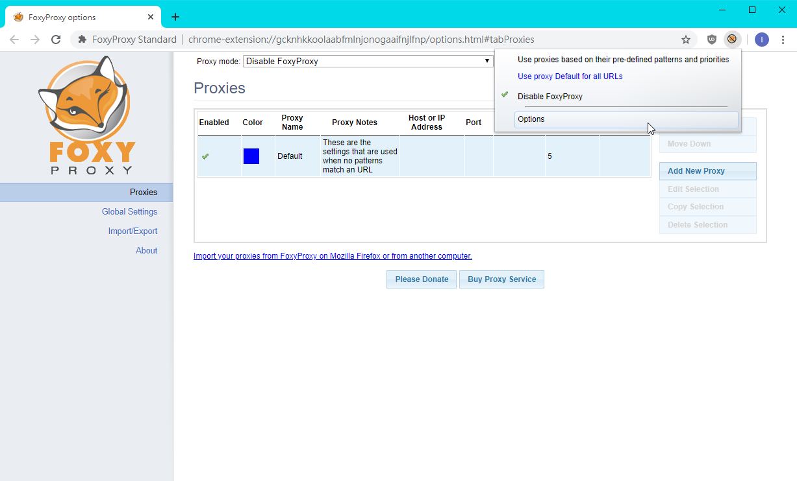
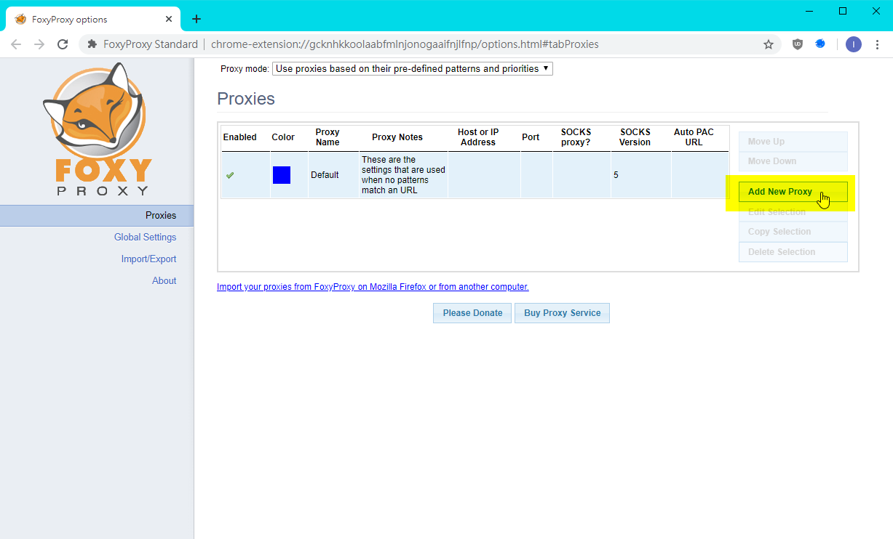
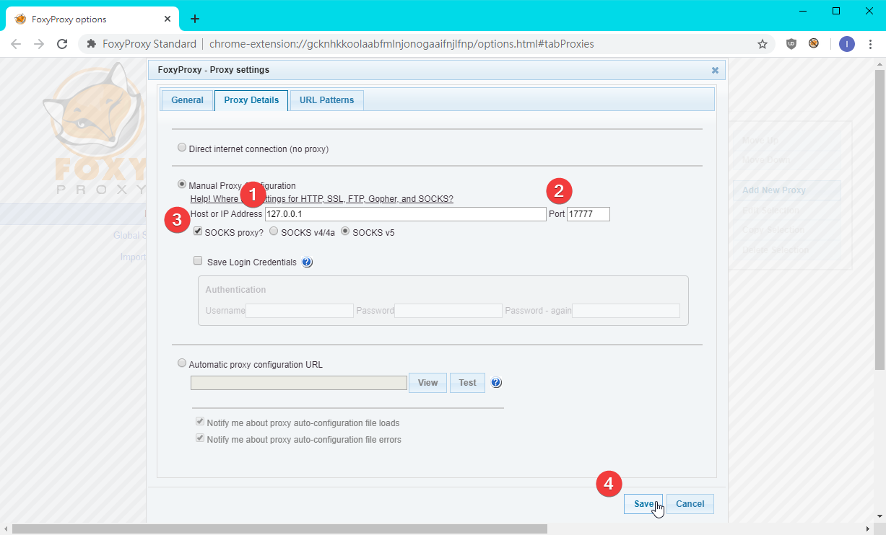
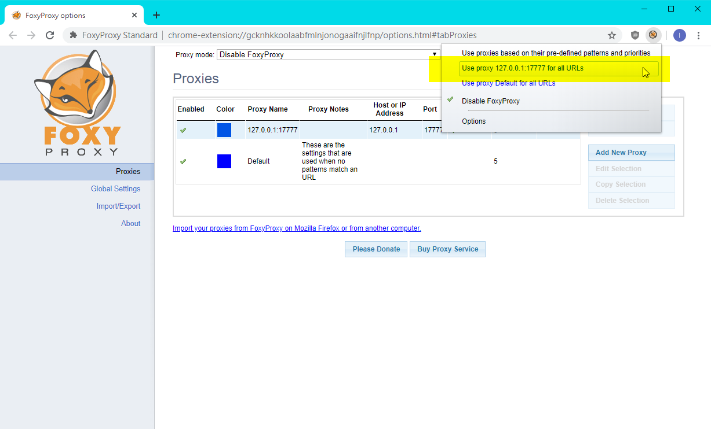

# Chrome FoxyProxy 使用說明 / Chrome FoxyProxy Usage

## 新增 Proxy / Config new proxy

### 開啟 FoxyProxy 設定 / Open "options" of FoxyProxy

### 按下 "Add New Proxy" / Click "Add New Proxy"

### 填寫 Proxy 資料並且按下 "Save" / Fill proxy config and click "Save"

## 啟用 Proxy / Enable Proxy

## 停用 Proxy / Disable Proxy

